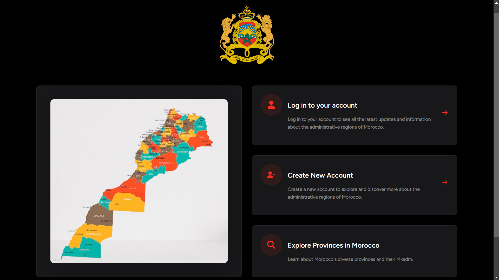
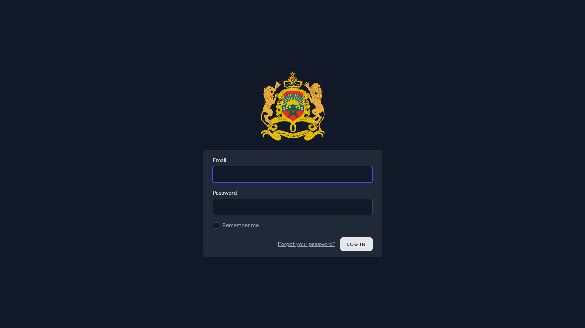
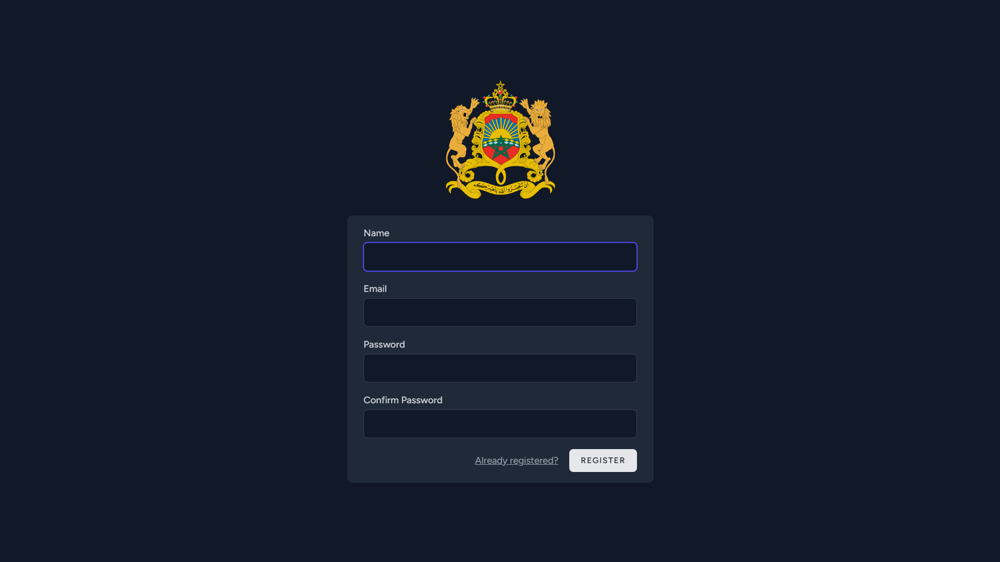
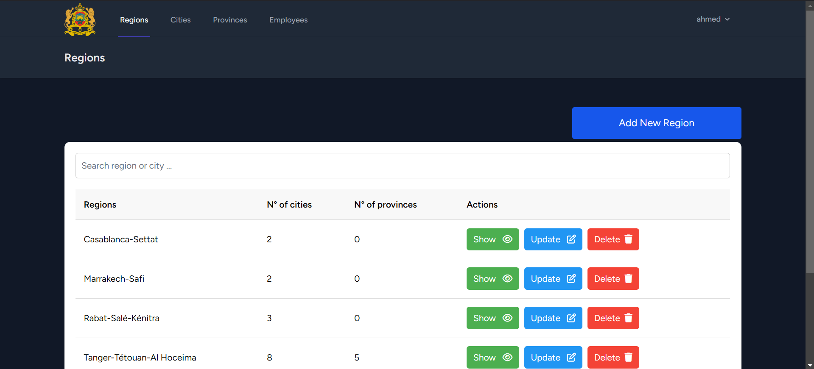
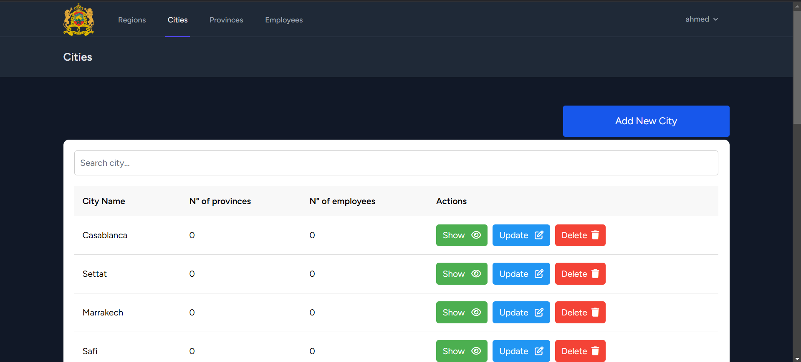
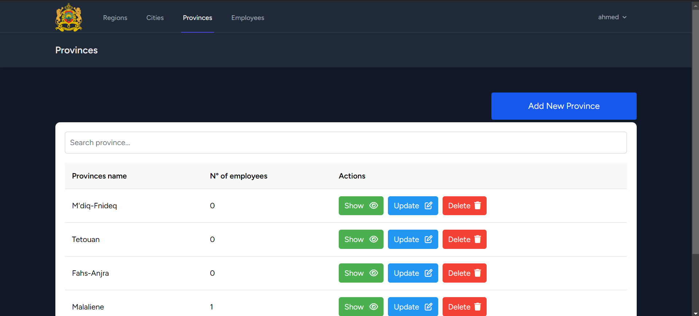
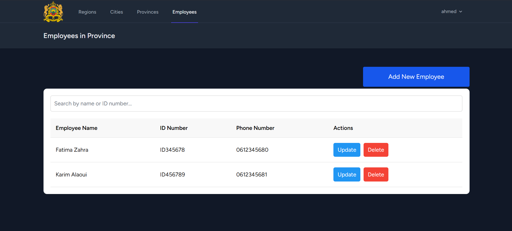

# Morocco Regions and Cities Management App

This is a Laravel-based CRUD application designed to manage the administrative regions of Morocco. It allows users to:

-   View all the regions in Morocco.
-   Explore cities within each region.
-   Explore provinces within each city.
-   Manage worker data for each city.

## Features

1. **Regions Management**:

    - View a list of all regions in Morocco.
    - Add, edit, and delete regions.

2. **Cities Management**:

    - View cities associated with each region.
    - Add, edit, and delete cities within a region.

3. **Provinces Management**:

    - View provinces associated with each city.
    - Add, edit, and delete provinces.

4. **Workers Management**:

    - Manage worker details for each city.
    - Add, edit, and delete worker records.

5. **Authentication**:
    - Secure login and user account creation.

## Tech Stack

-   **Framework**: Laravel 10
-   **Frontend**: Blade templates (HTML, CSS, JavaScript)
-   **Database**: MySQL
-   **Styling**: TailwindCSS (or other CSS framework based on your design)

## Setup Instructions

1. **Clone the repository**:

    ```bash
    git clone <repository-url>
    cd <repository-directory>
    ```

2. **Install dependencies**:

    ```bash
    composer install
    npm install
    ```

3. **Environment Setup**:

    - Copy `.env.example` to `.env`:
        ```bash
        cp .env.example .env
        ```
    - Update the `.env` file with your database credentials:
        ```env
        DB_CONNECTION=mysql
        DB_HOST=127.0.0.1
        DB_PORT=3306
        DB_DATABASE=<your-database-name>
        DB_USERNAME=<your-database-username>
        DB_PASSWORD=<your-database-password>
        ```

4. **Generate application key**:

    ```bash
    php artisan key:generate
    ```

5. **Run migrations**:

    ```bash
    php artisan migrate
    ```

6. **Seed the database (optional)**:
   If you have seeders set up for initial data:

    ```bash
    php artisan db:seed
    ```

7. **Run the application**:
    ```bash
    php artisan serve
    ```
    The application will be accessible at [http://127.0.0.1:8000](http://127.0.0.1:8000).

## Screenshots

### Homepage



### Login Page



### Regions View



### Cities Management



### Provinces Management



### Workers Management



### Authentication Page



## Folder Structure

-   `app/Models`: Contains Eloquent models for regions, cities, provinces, and workers.
-   `app/Http/Controllers`: Contains the controllers for managing CRUD operations.
-   `resources/views`: Contains Blade templates for the frontend.
-   `routes/web.php`: Defines web routes for the application.

## Future Enhancements

-   Add advanced search and filtering options.
-   Implement role-based access control (RBAC).
-   Improve the UI/UX for better user experience.
-   Add API endpoints for integration.

## Contributing

Contributions are welcome! Please follow these steps:

1. Fork the repository.
2. Create a new branch for your feature or bug fix.
3. Commit your changes.
4. Push your branch and submit a pull request.

## License

This project is open-source and available under the [MIT License](LICENSE).
